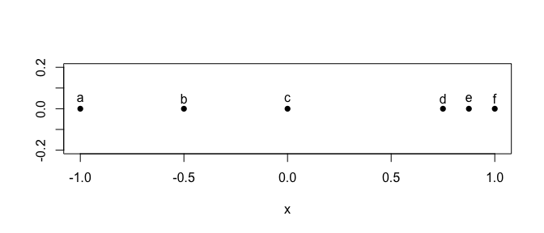

<!-- README.md is generated from README.Rmd. Please edit that file -->

# landmark

Calculate landmark sets for finite metric spaces using the maxmin
procedure (for fixed-radius balls) or an adaptation of it for rank data
(for roughly fixed-cardinality nearest
neighborhoods).

``` r
(x <- matrix(c(-1, -.5, 0, .75, .875, 1), dimnames = list(letters[1:6], "x")))
#>        x
#> a -1.000
#> b -0.500
#> c  0.000
#> d  0.750
#> e  0.875
#> f  1.000
plot(cbind(x, 0), asp = 1, pch = 16)
text(cbind(x, .05), labels = rownames(x))
```



## `maxmin` procedure

The original `maxmin` procedure produces a landmark set for covering a
point cloud with either of two minimal ball covers:

  - a minimum number of balls of fixed uniform radius
  - a fixed number of balls of minimum uniform radius

<!-- end list -->

``` r
x[landmarks_maxmin(x, radius = 0.5, engine = "C++"), , drop = FALSE]
#>    x
#> a -1
#> f  1
#> c  0
x[landmarks_maxmin(x, radius = 0.25, engine = "C++"), , drop = FALSE]
#>      x
#> a -1.0
#> f  1.0
#> c  0.0
#> b -0.5
x[landmarks_maxmin(x, radius = 0.125, engine = "C++"), , drop = FALSE]
#>       x
#> a -1.00
#> f  1.00
#> c  0.00
#> b -0.50
#> d  0.75
x[landmarks_maxmin(x, num_sets = 6L, engine = "C++"), , drop = FALSE]
#>        x
#> a -1.000
#> f  1.000
#> c  0.000
#> b -0.500
#> d  0.750
#> e  0.875
```

``` r
landmarks_maxmin(x, num_sets = 4L, engine = "R", cover = TRUE)
#>   landmark cover_set
#> 1        1         1
#> 2        6   4, 5, 6
#> 3        3         3
#> 4        2         2
landmarks_maxmin(x, radius = 0.5, engine = "R", cover = TRUE)
#>   landmark cover_set
#> 1        1      1, 2
#> 2        6   4, 5, 6
#> 3        3      2, 3
landmarks_maxmin(x, radius = 1.5, engine = "R", cover = TRUE)
#>   landmark    cover_set
#> 1        1      1, 2, 3
#> 2        6 2, 3, 4,....
landmarks_maxmin(x, radius = 3.5, engine = "R", cover = TRUE)
#>   landmark    cover_set
#> 1        1 1, 2, 3,....
```

## `lastfirst` procedure

An adaptation of `maxmin` to ranked distances will produce a landmark
set for covering a point cloud with either of two minimal neighborhood
covers:

  - a minimum number of neighborhoods of fixed (approximately) uniform
    cardinality
  - a fixed number of neighborhoods of minimal (approximately) uniform
    cardinality

Cardinality is only exact up to ties, which may be handled different
ways and will result in cover sets of different
cardinalities.

``` r
x[landmarks_lastfirst(x, cardinality = 3L, seed_index = 6L), , drop = FALSE]
#>    x
#> f  1
#> a -1
x[landmarks_lastfirst(x, cardinality = 2L, seed_index = 6L), , drop = FALSE]
#>       x
#> f  1.00
#> a -1.00
#> c  0.00
#> d  0.75
x[landmarks_lastfirst(x, num_sets = 4L, seed_index = 6L), , drop = FALSE]
#>       x
#> f  1.00
#> a -1.00
#> c  0.00
#> d  0.75
x[landmarks_lastfirst(x, cardinality = 1L, seed_index = 6L), , drop = FALSE]
#>        x
#> f  1.000
#> a -1.000
#> c  0.000
#> d  0.750
#> b -0.500
#> e  0.875
```

``` r
landmarks_lastfirst(x, cardinality = 1L, seed_index = 6L, engine = "C++", cover = TRUE)
#>   landmark cover_set
#> 1        6         6
#> 2        1         1
#> 3        3         3
#> 4        4         4
#> 5        2         2
#> 6        5         5
landmarks_lastfirst(x, num_sets = 4L, seed_index = 6L, engine = "C++", cover = TRUE)
#>   landmark cover_set
#> 1        6      5, 6
#> 2        1      1, 2
#> 3        3      2, 3
#> 4        4      4, 5
landmarks_lastfirst(x, cardinality = 3L, seed_index = 6L, engine = "C++", cover = TRUE)
#>   landmark cover_set
#> 1        6   4, 5, 6
#> 2        1   1, 2, 3
landmarks_lastfirst(x, cardinality = 5L, seed_index = 6L, engine = "C++", cover = TRUE)
#>   landmark    cover_set
#> 1        6 2, 3, 4,....
#> 2        1 1, 2, 3,....
```

# references

This package was spun off from [the Mapper
package](https://github.com/peekxc/Mapper/).

A rigorous mathematical treatment is underway at [this Overleaf
project](https://www.overleaf.com/read/fpjrtgfjstyx).
